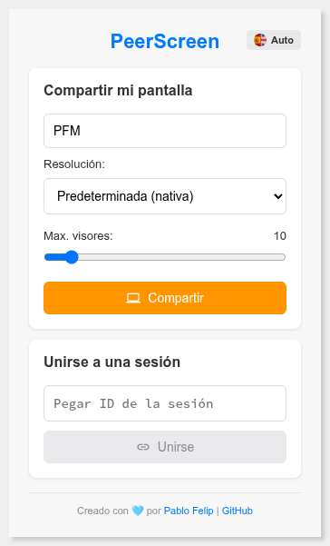
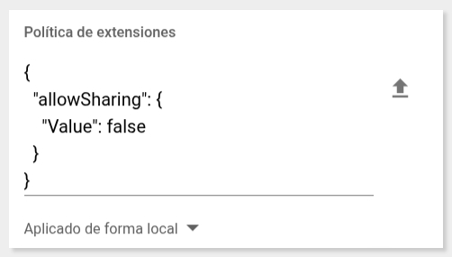
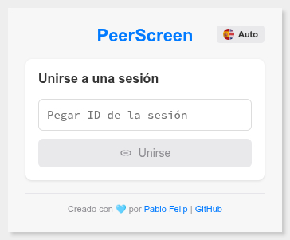

# PeerScreen

PeerScreen es una extensión para Google Chrome que te permite compartir tu pantalla con otros usuarios de forma sencilla y segura. Utilizando la tecnología WebRTC, la conexión se establece directamente de navegador a navegador (peer-to-peer), garantizando una baja latencia y la máxima privacidad, ya que el vídeo no pasa por ningún servidor intermedio. La extensión, construida sobre la moderna arquitectura Manifest V3 de Chrome, genera un ID de sesión único y un código QR para que otros usuarios con la extensión también instalada puedan unirse a tu retransmisión al instante.

<p align="center">
  
</p>


## ✨ Características principales

* **Conexión segura P2P:** El streaming de vídeo se realiza directamente entre tu navegador y el de los espectadores gracias a WebRTC.
* **Compartir con facilidad:** Inicia una sesión y compártela al instante mediante un ID único o un código QR. Los espectadores se unirán utilizando también la extensión.
* **Controles para el anfitrión:** Pausa y reanuda la transmisión en cualquier momento.
* **Soporte multi-espectador:** Permite que varios usuarios se unan a la misma sesión. El anfitrión puede establecer el número máximo de espectadores desde la interfaz.
* **Internacionalización:** Interfaz disponible en catalán, español e inglés (por defecto). Detecta automáticamente el idioma del navegador y, además, permite al usuario forzar su preferencia a español o inglés.
* **Arquitectura moderna:** Desarrollada desde cero para ser compatible con Manifest V3 de Chrome.
* **Ligera y privada:** No requiere servicios de sincronización de Google y almacena las preferencias localmente.


## 💡 Caso de uso y limitaciones

**Caso de uso principal:**
La extensión se ha diseñado de manera específica para funcionar de forma óptima en el contexto de un **aula de formación o una sala de reuniones**, permitiendo emitir la pantalla de un docente, ponente o estudiante al resto de asistentes conectados a la **misma red local (cableada o WiFi)**.

**Limitaciones de conexión (NAT Traversal):**
Por sencillez y para mantener la extensión gratuita, **no se utilizan servidores TURN**. Esto tiene una implicación importante:
* ✅ La conexión funcionará sin problemas entre usuarios dentro de la misma red.
* ❌ Es muy probable que la conexión **falle** si el emisor y el receptor se encuentran en redes diferentes y **restrictivas** (por ejemplo, dos redes de empresa distintas, o una red móvil y una red doméstica con NAT simétrico). Esto se debe a que sin un servidor TURN es muy difícil atravesar ciertos tipos de NAT.

## 🚀 Instalación

### Opción 1: Desde la Chrome Web Store (recomendado)

1.  Visita la [página de PeerScreen](https://chromewebstore.google.com/detail/cpoommbndjmjochpijjobgmnbgbkikdn) en la Chrome Web Store.
2.  Haz clic en "Añadir a Chrome".
3.  ¡Listo! Ya puedes usar la extensión.

### Opción 2: Desde el código fuente (para desarrolladores y administradores TIC)

1.  Descarga y descomprime o clona este repositorio en tu máquina local:
    ```bash
    git clone https://github.com/pfelipm/peerscreen.git
    ```
2.  Abre Google Chrome y ve a la página de extensiones: `chrome://extensions/`.
3.  Activa el **"Modo de desarrollador"** en la esquina superior derecha.
4.  Haz clic en el botón **"Cargar descomprimida"**.
5.  Selecciona la carpeta del repositorio que acabas de descargar o clonar. La extensión se instalará localmente.
6. ¡Listo! El icono de la extensión aparecerá en tu barra de extensiones, te sugiero que lo fijes a ella para usarlo con mayor comodidad.

Esta opción puede facilitar el despliegue de la extensión en un aula en la que los ordenadores estén configurados para navegar de manera predeterminada en modo incógnito. En este caso, tras instalarla en el navegador de cada equipo, marca la opción **"Permitir en incógnito"** en los ajustes de la extensión para que permanezca activa en este modo.

## 🏢 Configuración para administradores (Google Workspace)

PeerScreen permite a los administradores de TI restringir funcionalidades mediante **políticas administradas de Chrome**. Esto es ideal para entornos educativos donde se desea que los alumnos solo puedan unirse a sesiones y no emitir.

### Modo "solo visor" (restricción de emisión)

Para desactivar la capacidad de compartir pantalla en una unidad organizativa (UO) específica:

1.  En la consola de administración de Google, ve a **Dispositivos > Chrome > Aplicaciones y extensiones > Usuarios y navegadores**.
2.  Selecciona la UO (ej: Alumnado) y busca la extensión PeerScreen.
3.  En el panel de configuración de la derecha, busca el campo **Configuración de la política de la extensión** (JSON).
4.  Pega el siguiente código JSON:

```json
{
  "allowSharing": {
    "Value": false
  }
}
```

Al aplicar esto, la interfaz de "Compartir pantalla" desaparecerá de la extensión para esos usuarios, dejando únicamente visible la sección de "Unirse a una sesión".

<p align="center">
  
  <br>
  <em>Configuración de la política en la consola de Google Workspace</em>
</p>

<p align="center">
  
  <br>
  <em>Vista de la extensión con la restricción aplicada (Modo solo visor)</em>
</p>


## 💙 Créditos

Este proyecto ha sido creado y es mantenido por **[Pablo Felip](https://www.linkedin.com/in/pfelipm/)**.

Agradecimiento especial a **[Toño Gutiérrez](https://transformacioneducativa.es/equipo-coordinacion/)**, del equipo de coordinación de GEG Spain, por sus valiosas sugerencias relativas a limitar la compartición de pantalla para el alumnado, así como por proponer el uso exclusivo de mayúsculas y la eliminación de caracteres ambiguos (0, O, 1, I) para facilitar la conexión de los estudiantes.

Se utilizan las siguientes bibliotecas de terceros:
* [PeerJS](https://peerjs.com/)
* [QRCode.js](https://github.com/davidshimjs/qrcodejs)

## ✊ Licencia

Este proyecto se distribuye bajo los términos del archivo [LICENSE](/LICENSE).
